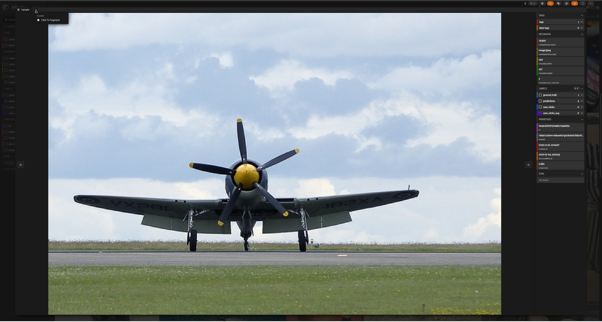
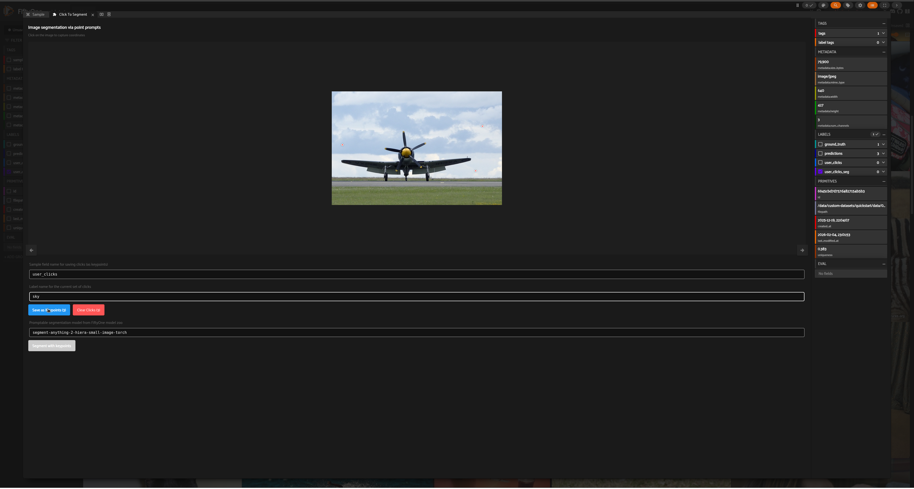
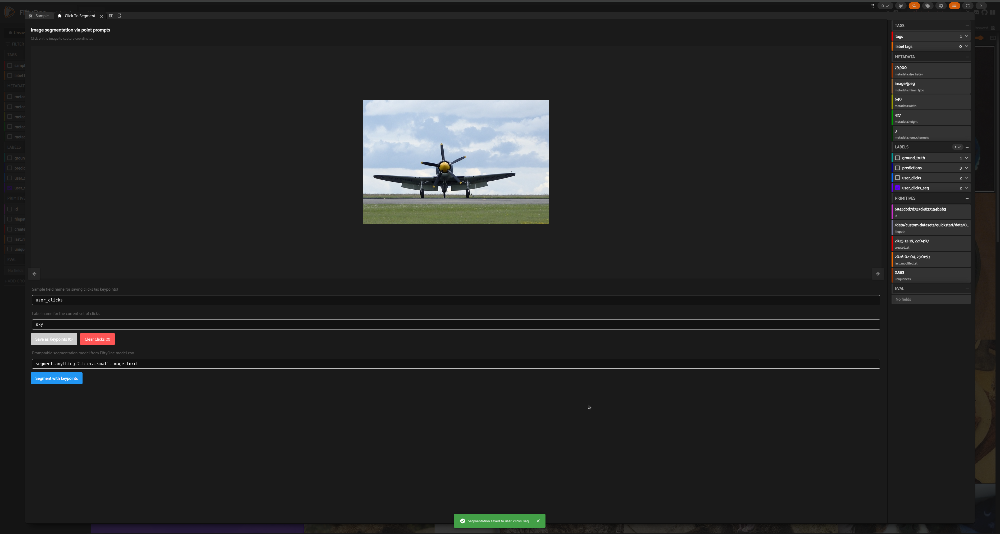
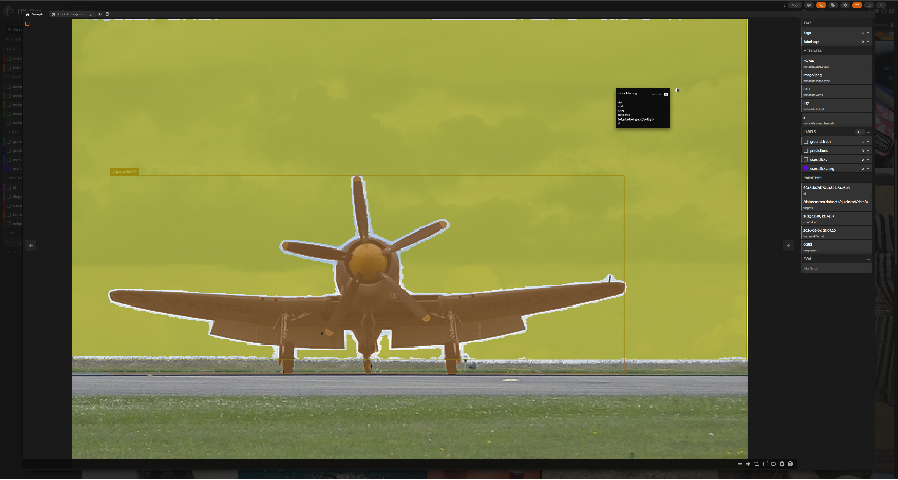

# Image segmentation via point prompts

The `click_segmentation` panel is an interactive tool for generating point prompts via clicks. These point prompts can be input to a segmentation model that accepts point prompts (such as Segment Anything Model) to create segmentation masks.

## Usage

### Via FiftyOne App

_Select a sample and open Click To Segment panel_

_In the Click To Segment panel, add a set of clicks for airplane and save as keypoints_

_Add another set of clicks for sky and save as keypoints_

_Choose a segmentation model from FiftyOne model zoo and click on Segment with Keypoints button_

_Segmentation masks will be added to the Sample_

